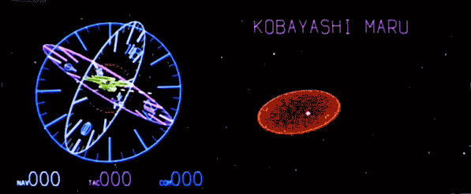
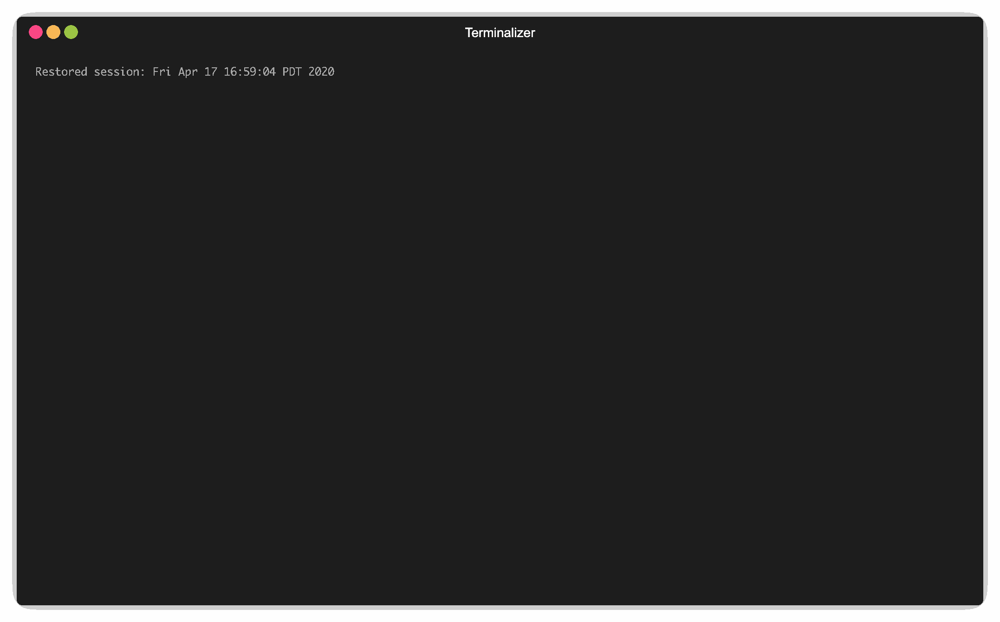

# Relayer



[](https://www.repostatus.org/#wip)

[](https://godoc.org/github.com/cosmos/relayer)
[](https://goreportcard.com/report/github.com/cosmos/relayer)
[](https://github.com/cosmos/relayer/blob/master/LICENSE)
[](https://github.com/cosmos/relayer)
[](https://github.com/umee-network/cosmos/relayer/latest)

This repository contains a Golang implementation of a Cosmos [IBC](https://ibcprotocol.org/)
relayer. The `relayer` package contains a basic relayer implementation that is
meant for users wanting to relay packets/data between sets of
[IBC](https://ibcprotocol.org/)-enabled chains.

The relayer implementation also acts as a base reference implementation for those
wanting to build their [IBC](https://ibcprotocol.org/)-compliant relayer.
  
> **NOTE:** The relayer is currently in alpha and is not production ready. If it
> is used in production, it should always be run in a secure environment and
> only with just enough funds to relay transactions. Security critical operations
> **should** manually verify that the client identifier used in the configuration
> file corresponds to the correct initial consensus state of the counter-party
> chain. This can be done by querying the initial consensus state and the header
> of the counter-party and verifying that the root and hash of the next validator
> set match. This can be considered equivalent to checking the sha hash of a
> download or a GPG signature.

- [Relayer](#relayer)
  - [Security Notice](#security-notice)
  - [Code of Conduct](#code-of-conduct)
  - [Testnet](#testnet)
  - [Compatibility Table](#compatibility-table)
  - [Features](#features)
  - [Relayer Terminology](#relayer-terminology)
  - [Recommended Pruning Settings](#recommended-pruning-settings)
  - [Demo](#demo)
  - [Setting up Developer Environment](#setting-up-developer-environment)

## Security Notice

If you would like to report a security critical bug related to the relayer repo,
please send an email to [`security@cosmosnetwork.dev`](mailto:security@cosmosnetwork.dev)

## Code of Conduct

The Cosmos community is dedicated to providing an inclusive and harassment free
experience for contributors. Please visit [Code of Conduct](CODE_OF_CONDUCT.md) for more information.

## Testnet

If you would like to join a relayer testnet, please [check out the instructions](./testnets/README.md).

## Compatibility Table

| chain                                    | build                                                                                                                                                   | supported ports |
|------------------------------------------|---------------------------------------------------------------------------------------------------------------------------------------------------------|-----------------|
| [gaia](https://github.com/cosmos/gaia)   |   | transfer        |
| [akash](https://github.com/ovrclk/akash) |  | transfer        |

## Features

The relayer supports the following:

- creating/updating IBC Tendermint light clients
- creating IBC connections
- creating IBC transfer channels.
- initiating a cross chain transfer
- relaying a cross chain transfer transaction, its acknowledgement, and timeouts
- relaying from state
- relaying from streaming events
- sending an UpgradePlan proposal for an IBC breaking upgrade
- upgrading clients after a counter-party chain has performed an upgrade for IBC breaking changes

The relayer currently cannot:

- create clients with user chosen parameters (such as UpgradePath)
- submit IBC client unfreezing proposals
- monitor and submit misbehavior for clients
- use IBC light clients other than Tendermint such as Solo Machine
- connect to chains which don't implement/enable IBC
- connect to chains using a different IBC implementation (chains not using SDK's `x/ibc` module)

## Relayer Terminology

A `path` represents an abstraction between two IBC-connected networks. Specifically,
the `path` abstraction contains metadata about a source chain, a destination
chain and a relaying strategy between thw two networks. The metadata for both
the source and destination networks contains the following:

- `chain-id`: The chain ID of the network.
- `client-id`: The client ID on the corresponding chain representing the other chain's light client.
- `connection-id`: The connection ID on the corresponding chain representing a connection to the other chain.
- `channel-id`: The channel ID on the corresponding chain's connection representing a channel on the other chain.
- `port-id`: The IBC port ID which a relevant module binds to on the corresponding chain.
- `order`: Determines if packets from a sending module must be `ORDERED` or `UNORDERED`.
- `version`: IBC version.

Two chains may have many different paths between them. Any path with different
clients, connections, or channels are considered uniquely different and non-fungible.

When using with live networks, it is advised to pre-select your desired parameters
for your clients, connections, and channels. The relayer will automatically
reuse any existing clients that match your configurations since clients,
connections, and channels are public goods (no one has control over them).

## Recommended Pruning Settings

The relayer relies on old headers and proofs constructed at past block heights
to facilitate correct[IBC](https://ibcprotocol.org/) behavior. For this reason,
connected full nodes may prune old blocks once they have passed the unbonding
period of the chain but not before. Not pruning at all is not necessary for a
fully functional relayer, however, pruning everything will lead to many issues!

Here are the settings used to configure SDK-based full nodes (assuming 3 week unbonding period):

```shell
... --pruning=custom --pruning-keep-recent=362880 --pruning-keep-every=0 --pruning-interval=100
```

`362880 (3*7*24*60*60 / 5 = 362880)` represents a 3 week unbonding period (assuming 5 seconds per block).

Note, operators can tweak `--pruning-keep-every` and `--pruning-interval` to their
liking.

## Demo



While the relayer is under active development, it is meant primarily as a learning
tool to better understand the Inter-Blockchain Communication (IBC) protocol. In
that vein, the following demo demonstrates the core functionality which will
remain even after the changes:

```bash
# ensure go and jq are installed 
# Go Documentation: https://golang.org/doc/install
# jq Documentation: https://stedolan.github.io/jq/download

# First, download and build the gaia source code so we have a working blockchain to test against
$ make get-gaia build-gaia

# two-chainz creates two gaia-based chains with data directories in this repo
# it also builds and configures the relayer for operations with those chains
$ ./scripts/two-chainz
# NOTE: If you want to stop the two gaia-based chains running in the background use `killall gaiad`

# At this point the relayer --home directory is ready for normal operations between
# ibc-0 and ibc-1. Looking at the folder structure of the relayer at this point is helpful
# NOTE: to install tree try `brew install tree` on mac or `apt install tree` on linux
$ tree ~/.relayer

# See if the chains are ready to relay over
$ rly chains list

# See the current status of the path you will relay over
$ rly paths list

# Now you can connect the two chains with one command:
$ rly tx link demo -d -o 3s

# Check the token balances on both chains
$ rly q balance ibc-0
$ rly q bal ibc-1

# Then send some tokens between the chains
$ rly tx transfer ibc-0 ibc-1 1000000samoleans $(rly chains address ibc-1)
$ rly tx relay demo -d
$ rly tx acks demo -d

# See that the transfer has completed
$ rly q bal ibc-0
$ rly q bal ibc-1

# Send the tokens back to the account on ibc-0
$ rly tx transfer ibc-1 ibc-0 1000000ibc/27A6394C3F9FF9C9DCF5DFFADF9BB5FE9A37C7E92B006199894CF1824DF9AC7C $(rly chains addr ibc-0)
$ rly tx relay demo -d
$ rly tx acks demo -d

# See that the return trip has completed
$ rly q bal ibc-0
$ rly q bal ibc-1

# NOTE: you will see the stake balances decreasing on each chain. This is to pay for fees
# You can change the amount of fees you are paying on each chain in the configuration.
```

## Setting up Developer Environment

Working with the relayer can frequently involve working with local development
branches of your desired applications/networks, e.g. `gaia`, `akash`, in addition
to `cosmos-sdk` and the `relayer`.

To setup your environment to point at the local versions of the code and reduce
the amount of time in your read-eval-print loops try the following:

1. Set `replace github.com/cosmos/cosmos-sdk => /path/to/local/github.com/comsos/cosmos-sdk`
   at the end of the `go.mod` files for the `relayer` and your network/application,
   e.g. `gaia`. This will force building from the local version of the `cosmos-sdk`
   when running the `./dev-env` script.
2. After `./dev-env` has run, you can use `go run main.go` for any relayer
   commands you are working on. This allows you make changes and immediately test
   them as long as there are no server side changes.
3. If you make changes in `cosmos-sdk` that need to be reflected server-side,
   be sure to re-run `./two-chainz`.
4. If you need to work off of a `gaia` branch other than `master`, change the
   branch name at the top of the `./two-chainz` script.
